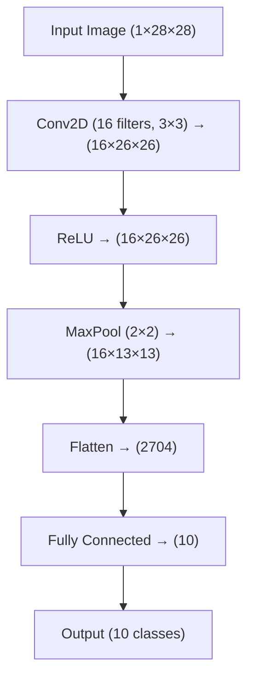

# Introduction to Convolutional Neural Networks (CNNs)

## 1. Motivation: Why CNNs?

Traditional neural networks (fully connected):
- Flatten images → lose spatial structure
- Struggle with large images
- Too many parameters

Example:
A 28×28 image → 784 inputs  
A 224×224 image → 50,000+ inputs (Too many Parameters for a Simple Neural Network!)

---

## 2. Key Idea of CNNs

Instead of looking at the whole image at once:

CNNs look at **small regions (patches)**

They learn:
- edges
- textures
- shapes
- objects

---

## 3. Convolution Operation

A convolution applies a small filter (kernel) over an image.
Image ⊗ Filter → Feature Map

## 4. Visual Intuition

<div align="center">


<p><em>Figure X: Example of a convolutional kernel. Source: 
<a href="https://medium.com/thedeephub/convolutional-neural-networks-a-comprehensive-guide-5cc0b5eae175">The Deep Hub</a>.</em></p>


<p><em>Figure Y: Filters transform the input into useful feature representations. Source: 
<a href="https://www.jeremyjordan.me/convolutional-neural-networks/">Jeremy Jordan</a>.</em></p>

</div>

## 5. CNN Architecture

A typical CNN looks like:


<div align="center">


<p><em>Figure X: Example of a Convolutional Neural Network (CNN) architecture. Source: 
<a href="https://medium.com/thedeephub/convolutional-neural-networks-a-comprehensive-guide-5cc0b5eae175">
The Deep Hub (Medium)
</a>.</em></p>

</div>

## 6. Pooling (Downsampling)

Pooling reduces size while keeping important information.

Common type: **Max Pooling**

<div align="center">

<h4>Pooling Visualization</h4>


<p><em>Figure X: Examples of mean pooling and max pooling operations. Source: 
<a href="https://medium.com/thedeephub/convolutional-neural-networks-a-comprehensive-guide-5cc0b5eae175">
The Deep Hub (Medium)
</a>.</em></p>

</div>

## 7. Why CNNs Work Well

- Preserve spatial relationships
- Share weights (fewer parameters)
- Detect hierarchical features:
  - edges → textures → shapes → objects

<div align="center">


<p><em>Figure X: Example of CNN classification explained using the LIME algorithm. Highlighted regions indicate the areas of the image that contributed most to the model’s prediction.</em></p>

</div>

---

## 8. Simple CNN Code Example (PyTorch)

```python
import torch
import torch.nn as nn
import torch.nn.functional as F

class SimpleCNN(nn.Module):
    def __init__(self):
        super().__init__()
        self.conv1 = nn.Conv2d(1, 16, 3)   # 1 input channel, 16 filters
        self.pool = nn.MaxPool2d(2, 2)
        self.fc1 = nn.Linear(16 * 13 * 13, 10)

    def forward(self, x):
        x = self.pool(F.relu(self.conv1(x)))
        x = x.view(-1, 16 * 13 * 13)
        x = self.fc1(x)
        return x

model = SimpleCNN()

# Load MNIST dataset
transform = transforms.ToTensor()

train_dataset = datasets.MNIST(
    root="./data",
    train=True,
    download=True,
    transform=transform
)

train_loader = DataLoader(
    train_dataset,
    batch_size=64,
    shuffle=True
)

# Define loss function and optimizer
criterion = nn.CrossEntropyLoss()
optimizer = optim.Adam(model.parameters(), lr=0.001)

# Training loop
epochs = 3

for epoch in range(epochs):
    running_loss = 0.0

    for images, labels in train_loader:
        # Clear old gradients
        optimizer.zero_grad()

        # Forward pass
        outputs = model(images)

        # Compute loss
        loss = criterion(outputs, labels)

        # Backward pass
        loss.backward()

        # Update weights
        optimizer.step()

        running_loss += loss.item()

    avg_loss = running_loss / len(train_loader)
    print(f"Epoch [{epoch+1}/{epochs}], Loss: {avg_loss:.4f}")

print("Training complete!")
```

### Simple CNN Training Script

This script:
- loads the MNIST handwritten digit dataset
- creates batches of training images
- feeds them through the CNN
- computes the error
- updates the weights using backpropagation

---

## 9. Key Differences: CNN vs Fully Connected

| Feature | Fully Connected NN | CNN |
|--------|------------------|-----|
| Input handling | Flattened | Spatial |
| Parameters | Many | Fewer |
| Best for | General data | Images |

---

## 10. Summary

CNNs:
- Use **filters** to scan images
- Learn **spatial features**
- Reduce parameters with **weight sharing**
- Are the foundation of modern computer vision

---
